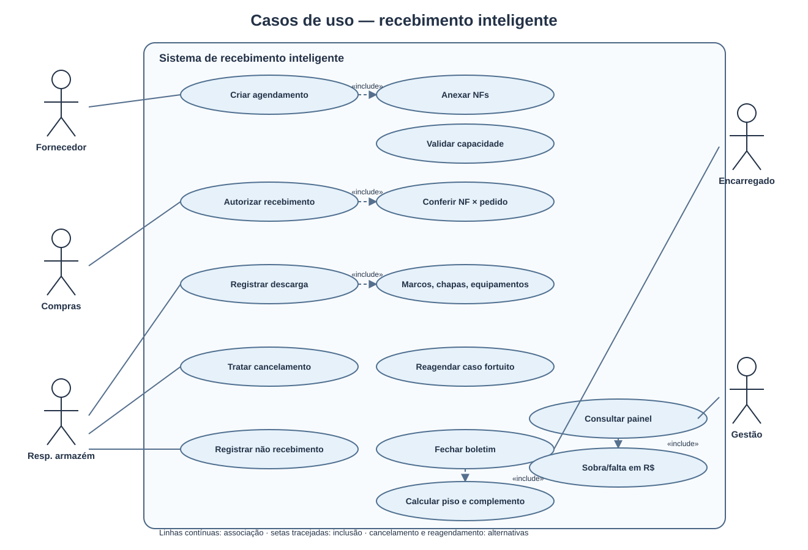
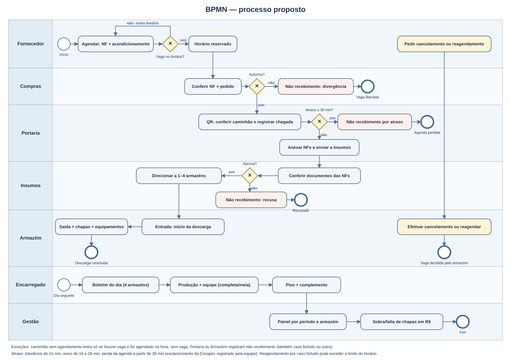
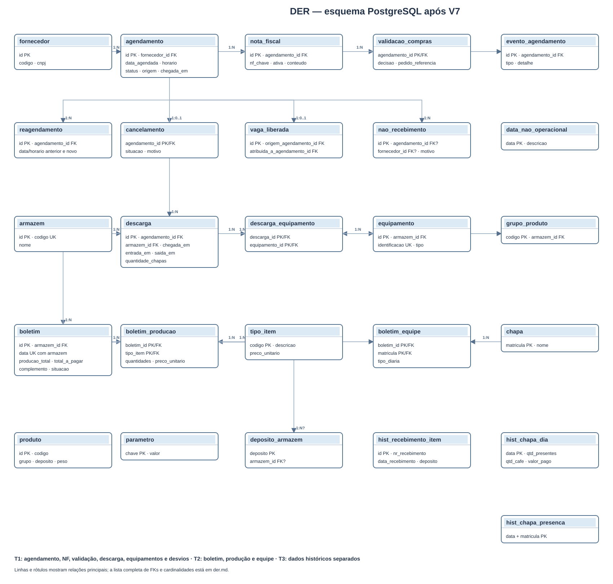

# Artefatos obrigatórios

A ausência de qualquer um destes itens é eliminatória. Devem estar em texto e imagem,
visíveis direto na página do GitHub.

| Artefato | Arquivo | Status |
|---|---|---|
| Relatório gerencial (resposta à pergunta da Tarefa 3, números, método, tratamento das inconsistências, origem dos dados) | [`relatorio-gerencial.md`](relatorio-gerencial.md) | disponível |
| Diagrama de Caso de Uso (UML) | [`caso-de-uso.md`](caso-de-uso.md) + [`caso-de-uso.svg`](caso-de-uso.svg) | disponível |
| Diagrama BPMN do processo proposto | [`bpmn.md`](bpmn.md) + [`bpmn.svg`](bpmn.svg) | disponível |
| DER | [`der.md`](der.md) + [`der.svg`](der.svg) | disponível; base: [`api/migrations/V1__schema.sql`–`V7__painel_base.sql`](../api/migrations/) |

As imagens também podem ser vistas nesta página:

Os SVGs são gerados a partir de [`render-diagramas.cjs`](render-diagramas.cjs) com `node docs/render-diagramas.cjs`.

Outros documentos:

- [`API-TAREFA1.md`](API-TAREFA1.md) — fluxo, status, regras e todos os endpoints da Tarefa 1 (contrato para o front).
- [`API-TAREFA2.md`](API-TAREFA2.md) — contrato da API do boletim dos chapas (regra do piso, endpoints, erros).
- [`API-TAREFA3.md`](API-TAREFA3.md) — contrato do painel gerencial (indicadores, sobra/falta de chapas em R$, histórico) e a página `/painel`.
- [`GUIA-TAREFA2.md`](GUIA-TAREFA2.md) — guia da Tarefa 2 (regras, armadilhas e achados nos dados).
- [`API-LOGIN.md`](API-LOGIN.md) — login, perfis, permissões por perfil e usuários iniciais.
- [`DIFERENCIAIS.md`](DIFERENCIAIS.md) — os 7 diferenciais (QR + check-in, D-1, simulador, calendário, leitura da NF, Pergunte aos Dados, Qualidade dos Dados) e o boletim do dia com os 4 armazéns.
