# DER — esquema PostgreSQL

O [DER em SVG](der.svg) resume as 34 tabelas efetivas após as migrações [`V1`–`V16`](../api/migrations/), conferidas no PostgreSQL em execução. As remoções e renomeações intermediárias já estão aplicadas: a V5 removeu `agendamento_destino` e `agendamento_anexo` (criada na V3) e renomeou `feriado` para `data_nao_operacional`. Só `flyway_schema_history`, controle interno das migrações, fica fora do diagrama. PK = chave primária; FK = chave estrangeira; UK = unicidade. No SVG, a seta parte da tabela referenciada (lado 1) e chega à tabela que guarda a FK (lado N); `0..1` indica FK opcional, cuja coluna aceita nulo. As 30 FKs do banco estão desenhadas.

O desenho tem três faixas: T1 (agendamento, portaria, acesso, descarga e cadastros), T2 (boletim) e T3 (base histórica e arquivos oficiais carregados pelo ETL). As tabelas `hist_*` preservam os códigos de origem e não têm FK para agendamento, fornecedor, produto ou chapa. Na T3, as únicas FKs são `hist_estoque_item → armazem` e as que ligam itens e PDFs à própria `hist_nota_fiscal`.

## Relações

| Origem | Cardinalidade | Destino / chave |
|---|---|---|
| Fornecedor | 1:N | Agendamento (`fornecedor_id`) |
| Fornecedor | 0..1:N | NaoRecebimento (`fornecedor_id`, nulo para caminhão sem cadastro, identificado por `fornecedor_nome`) |
| Usuario | 0..1:N | Agendamento (`solicitado_por_usuario_id`, V15): usuário autenticado que criou a reserva. Fica nulo nos registros anteriores à V15 e nas agendas criadas com a autenticação desligada (`app.auth.ativa=false`). O perfil FORNECEDOR só lista e altera as agendas em que é o solicitante |
| Usuario | 1:N | Sessao (`usuario_id`, `ON DELETE CASCADE`) |
| Usuario | 1:N | PortariaRecebimento (`conferido_por_usuario_id`, obrigatório: quem conferiu na portaria) |
| Usuario | 0..1:N | PortariaRecebimento (`decidido_por_usuario_id`, preenchido quando Insumos aprova ou recusa) |
| Agendamento | 1:N | NotaFiscal, EventoAgendamento, Reagendamento e Descarga (`agendamento_id`) |
| Agendamento | 1:0..1 | ValidacaoCompras, Cancelamento e PortariaRecebimento (`agendamento_id` PK/FK) |
| Agendamento | 0..1:N | NaoRecebimento (`agendamento_id`, nulo para chegada sem agendamento) |
| Agendamento | 1:0..1 | VagaLiberada (`origem_agendamento_id` UK); `atribuida_a_agendamento_id` é FK opcional (0..1:N) |
| Armazem | 1:N | Descarga, Equipamento, Boletim, GrupoProduto e HistEstoqueItem (`armazem_id`) |
| Armazem | 0..1:N | DepositoArmazem (`armazem_id` nulo = depósito fora da quebra por armazém) |
| Descarga | N:N | Equipamento via DescargaEquipamento |
| Boletim | 1:N | BoletimProducao e BoletimEquipe (`ON DELETE CASCADE`) |
| TipoItem | 1:N | BoletimProducao |
| Chapa | 1:N | BoletimEquipe |
| HistNotaFiscal | 1:N | HistNotaFiscalItem (`nota_fiscal_id` na PK composta, `ON DELETE CASCADE`) |
| HistNotaFiscal | 0..1:N | HistDocumentoAnexo (`nota_fiscal_id`, nulo para DANFE sem XML de mesmo nome e para o registro manual) |

## Restrições e medidas

- `descarga`: `UNIQUE(agendamento_id, armazem_id)`; seus marcos respeitam `chegada_em ≤ entrada_em ≤ saida_em`.
- `nota_fiscal`: índice único parcial para `nf_chave` ativa; há uma ou mais NFs por agendamento na regra de aplicação.
- `agendamento` (V16): `placa_veiculo` guarda a placa prevista, opcional. `exige_conferencia_portaria` vale `false` nas agendas anteriores à V16, que mantêm o fluxo antigo; a API grava `true` em toda agenda nova. Nesse caso a entrada na descarga só é aceita depois que Insumos aprova e `portaria_recebimento.situacao` fica `DIRECIONADO`.
- `portaria_recebimento` (V16): um registro por agendamento conferido. `situacao` ∈ `AGUARDANDO_DOCUMENTOS`, `PENDENTE_INSUMOS`, `DIRECIONADO`, `RECUSADO`; `placa` tem CHECK `^[A-Z]{3}[0-9][A-Z0-9][0-9]{2}$` (padrão antigo ou Mercosul); `conferido_em`, `enviado_em` e `decidido_em` marcam conferência, envio a Insumos e decisão. A auditoria vai para `evento_agendamento`, cujo CHECK de `tipo` ganhou `PORTARIA_CONFERENCIA`, `PORTARIA_ENVIO` e `INSUMOS_DECISAO`.
- `vaga_liberada`: `status = 'ATRIBUIDA'` se e somente se `atribuida_a_agendamento_id` estiver preenchido.
- `usuario` e `sessao` (V8): `login` UK, senha em PBKDF2 e, da sessão, apenas o SHA-256 do token (`token_hash` PK). `papel` aceita ADMIN, DIRETORIA, COMPRAS, ARMAZEM, ENCARREGADO, FORNECEDOR, INSUMO e PORTEIRO; os dois últimos vieram da V9. Antes as duas tabelas serviam só ao login e ficavam fora do diagrama. Desde a V15 e a V16, `usuario` identifica quem criou a agenda e quem conferiu ou decidiu na portaria, por isso ambas aparecem no SVG.
- `boletim`: `UNIQUE(armazem_id, data)`; `boletim_producao` e `boletim_equipe` têm PK composta. `arquivo_origem` (V13) marca os boletins vindos da carga oficial, que o ETL substitui a cada recarga.
- Valores e preços das tabelas operacionais (`boletim`, `tipo_item`, `boletim_producao`) usam `numeric(...,4)`. As tabelas históricas mantêm a escala da origem: `hist_chapa_dia.valor_pago`, `hist_nota_fiscal.valor_total` e `hist_nota_fiscal_item.valor_total` usam escala 2, e `hist_nota_fiscal_item.valor_unitario` usa escala 6. `total_a_pagar` é o custo do boletim para o painel. O `quantidade_chapas` da descarga mede intensidade, não efetivo diário.
- `hist_recebimento_item.linha_origem` (V14) aponta a linha da planilha de origem, com índice único parcial (só quando preenchida). Assim, registros parciais legítimos com o mesmo pedido, item e recebimento não são descartados.
- `hist_estoque_item` (V12): PK composta (`arquivo_origem`, `linha_origem`) e FK para `armazem`. A planilha não informa a data de referência do saldo; `importado_em` registra só a carga.
- `hist_nota_fiscal` (V13): `arquivo_origem` UK e XML original em `conteudo_xml`, com `sha256`; `hist_documento_anexo.tipo` ∈ `DANFE_PDF`, `REGISTRO_MANUAL_PDF`. São documentos históricos, separados de `nota_fiscal` e dos agendamentos atuais.
- `equipamento_catalogo_oficial` (V13): catálogo global de tipo e utilização da fonte oficial. Não tem FK com `equipamento` nem `armazem` porque a fonte não informa quantidade nem armazém de lotação.
- `data_nao_operacional` e `parametro` são tabelas de regra independentes. `produto`, `hist_recebimento_item`, `hist_chapa_dia` e `hist_chapa_presenca` também não têm FK; `deposito_armazem` traduz depósitos físicos para a análise.

## Fonte textual Mermaid

```mermaid
erDiagram
  FORNECEDOR ||--o{ AGENDAMENTO : agenda
  FORNECEDOR |o--o{ NAO_RECEBIMENTO : identifica
  USUARIO |o--o{ AGENDAMENTO : solicita
  USUARIO ||--o{ SESSAO : autentica
  USUARIO ||--o{ PORTARIA_RECEBIMENTO : confere
  USUARIO |o--o{ PORTARIA_RECEBIMENTO : decide
  AGENDAMENTO ||--|{ NOTA_FISCAL : anexa
  AGENDAMENTO ||--o| VALIDACAO_COMPRAS : recebe
  AGENDAMENTO ||--o| PORTARIA_RECEBIMENTO : passa_pela
  AGENDAMENTO ||--o{ DESCARGA : distribui
  AGENDAMENTO ||--o{ EVENTO_AGENDAMENTO : audita
  AGENDAMENTO ||--o{ REAGENDAMENTO : historiza
  AGENDAMENTO ||--o| CANCELAMENTO : permite
  AGENDAMENTO |o--o{ NAO_RECEBIMENTO : registra
  AGENDAMENTO ||--o| VAGA_LIBERADA : libera
  AGENDAMENTO |o--o{ VAGA_LIBERADA : ocupa
  ARMAZEM ||--o{ DESCARGA : recebe
  ARMAZEM ||--o{ EQUIPAMENTO : possui
  DESCARGA ||--o{ DESCARGA_EQUIPAMENTO : usa
  EQUIPAMENTO ||--o{ DESCARGA_EQUIPAMENTO : usado_em
  ARMAZEM ||--o{ BOLETIM : registra
  BOLETIM ||--o{ BOLETIM_PRODUCAO : contem
  BOLETIM ||--o{ BOLETIM_EQUIPE : aloca
  TIPO_ITEM ||--o{ BOLETIM_PRODUCAO : precifica
  CHAPA ||--o{ BOLETIM_EQUIPE : participa
  ARMAZEM ||--o{ GRUPO_PRODUTO : destino
  ARMAZEM |o--o{ DEPOSITO_ARMAZEM : mapeia
  ARMAZEM ||--o{ HIST_ESTOQUE_ITEM : guarda_saldo
  HIST_NOTA_FISCAL ||--o{ HIST_NOTA_FISCAL_ITEM : detalha
  HIST_NOTA_FISCAL |o--o{ HIST_DOCUMENTO_ANEXO : comprova
  FORNECEDOR {
    bigint id PK
    string codigo
    string razao_social
    string cnpj
  }
  USUARIO {
    int id PK
    string login UK
    string nome
    string papel
    string senha_hash
    boolean ativo
    timestamp ultimo_acesso_em
  }
  SESSAO {
    string token_hash PK
    int usuario_id FK
    timestamp expira_em
  }
  AGENDAMENTO {
    bigint id PK
    bigint fornecedor_id FK
    bigint solicitado_por_usuario_id FK
    date data_agendada
    time horario
    string acondicionamento
    string status
    timestamp chegada_em
    string placa_veiculo
    boolean exige_conferencia_portaria
    string origem
    int versao
  }
  PORTARIA_RECEBIMENTO {
    bigint agendamento_id PK, FK
    string situacao
    string placa
    timestamp conferido_em
    timestamp enviado_em
    timestamp decidido_em
    bigint conferido_por_usuario_id FK
    bigint decidido_por_usuario_id FK
    string observacao
  }
  NOTA_FISCAL {
    bigint id PK
    bigint agendamento_id FK
    string nf_numero
    string nf_chave
    decimal peso_total_kg
    boolean ativa
    binary conteudo
  }
  VALIDACAO_COMPRAS {
    bigint agendamento_id PK, FK
    string decisao
    string pedido_referencia
  }
  DESCARGA {
    bigint id PK
    bigint agendamento_id FK
    smallint armazem_id FK
    timestamp chegada_em
    timestamp entrada_em
    timestamp saida_em
    smallint quantidade_chapas
  }
  EVENTO_AGENDAMENTO {
    bigint id PK
    bigint agendamento_id FK
    string tipo
    string para_status
    json detalhe
  }
  REAGENDAMENTO {
    bigint id PK
    bigint agendamento_id FK
    date data_anterior
    date data_nova
    string motivo
  }
  CANCELAMENTO {
    bigint agendamento_id PK, FK
    string situacao
    string motivo
  }
  NAO_RECEBIMENTO {
    bigint id PK
    bigint agendamento_id FK
    bigint fornecedor_id FK
    string fornecedor_nome
    string motivo
  }
  VAGA_LIBERADA {
    bigint id PK
    bigint origem_agendamento_id FK, UK
    bigint atribuida_a_agendamento_id FK
    string status
  }
  ARMAZEM {
    smallint id PK
    string codigo UK
    string nome
  }
  EQUIPAMENTO {
    smallint id PK
    smallint armazem_id FK
    string identificacao UK
    string tipo
  }
  DESCARGA_EQUIPAMENTO {
    bigint descarga_id PK, FK
    smallint equipamento_id PK, FK
  }
  BOLETIM {
    bigint id PK
    smallint armazem_id FK
    date data
    decimal producao_total
    decimal total_a_pagar
    decimal complemento
    string situacao
    string arquivo_origem
  }
  BOLETIM_PRODUCAO {
    bigint boletim_id PK, FK
    string tipo_item PK, FK
    int qtd_descarga
    int qtd_remocao
    int qtd_transferencia
    decimal preco_unitario
  }
  BOLETIM_EQUIPE {
    bigint boletim_id PK, FK
    string matricula PK, FK
    string tipo_diaria
  }
  TIPO_ITEM {
    string codigo PK
    string descricao
    decimal preco_unitario
  }
  CHAPA {
    string matricula PK
    string nome
  }
  GRUPO_PRODUTO {
    string codigo PK
    string descricao
    smallint armazem_id FK
  }
  DEPOSITO_ARMAZEM {
    string deposito PK
    smallint armazem_id FK
    string observacao
  }
  PRODUTO {
    bigint id PK
    string codigo
    string grupo
    string deposito
    decimal peso_unitario
  }
  PARAMETRO {
    string chave PK
    decimal valor
  }
  DATA_NAO_OPERACIONAL {
    date data PK
    string descricao
  }
  HIST_RECEBIMENTO_ITEM {
    bigint id PK
    int linha_origem UK
    string nr_recebimento
    date data_recebimento
    string pedido_compra
    string item_codigo
    string nf_chave
    string deposito
    decimal peso_kg
  }
  HIST_CHAPA_DIA {
    date data PK
    smallint qtd_presentes
    smallint qtd_cafe
    decimal valor_pago
  }
  HIST_CHAPA_PRESENCA {
    date data PK
    string matricula PK
  }
  HIST_ESTOQUE_ITEM {
    string arquivo_origem PK
    int linha_origem PK
    smallint armazem_id FK
    string produto_codigo
    decimal quantidade
    timestamp importado_em
  }
  HIST_NOTA_FISCAL {
    bigint id PK
    string arquivo_origem UK
    string chave_acesso
    string numero
    timestamp data_emissao
    string emitente_cnpj
    string destinatario_cnpj
    decimal valor_total
    string sha256
    binary conteudo_xml
  }
  HIST_NOTA_FISCAL_ITEM {
    bigint nota_fiscal_id PK, FK
    int numero_item PK
    string codigo_fornecedor
    string ncm
    decimal quantidade
    decimal valor_total
  }
  HIST_DOCUMENTO_ANEXO {
    bigint id PK
    bigint nota_fiscal_id FK
    string arquivo_origem UK
    string tipo
    string sha256
    binary conteudo
  }
  EQUIPAMENTO_CATALOGO_OFICIAL {
    string tipo PK
    string utilizacao
    string arquivo_origem
  }
```

A fonte Mermaid lista as mesmas 34 tabelas e 30 FKs do SVG, com as colunas principais de cada uma. A lista completa de colunas está nas migrações.
